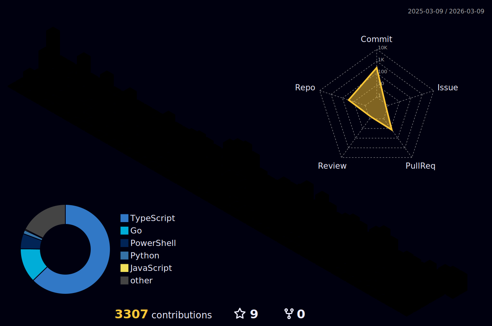

<div align="center">

[](https://git.io/typing-svg)

**Computer Engineer** specializing in Enterprise SaaS, AI Integration, and High-Performance Systems.

[](https://www.linkedin.com/in/felipeness/)
[](mailto:felipecoelho.ness@gmail.com)
[](https://portfolio-felipeness.vercel.app)

</div>

---

## Building

<table>
<tr>
<td width="50%" valign="top">

### LicitaWin
**AI-Powered Public Procurement SaaS**

Platform automating Brazilian government bidding with AI document analysis and generation.

**Stack:** Next.js · NestJS · OpenAI · Gemini · Redis · RabbitMQ · Prisma · Turborepo

- Real-time ComprasNet & PNCP integration
- AI-driven bid analysis and document generation
- Full SaaS: payments, subscriptions, gamification

</td>
<td width="50%" valign="top">

### [Yamaha Fit RH](https://www.afinidadeatitudeazul.com.br/)
**Enterprise HR Platform — Yamaha Brazil**

Multi-tenant cultural fit assessment system for national HR operations.

**Stack:** Next.js · NestJS 11 · Prisma · Docker · JWT/RBAC

- Multi-unit RBAC management
- 40-question cultural alignment assessment
- Advanced reporting & Excel export

</td>
</tr>
</table>

---

## Open Source

<table>
<tr>
<td width="50%" valign="top">

### [Micro-Frontend Architecture](https://github.com/Felipeness/micro-frontend-nextjs)
Production-ready Module Federation with observability.

`Next.js 14` `Webpack 5` `OpenTelemetry` `Playwright`

- 3 independent apps, shared state
- RED/USE metrics & distributed tracing
- Lighthouse: 95+

</td>
<td width="50%" valign="top">

### [Appointment API](https://github.com/Felipeness/appointment-api)
Enterprise healthcare scheduling with Clean Architecture.

`NestJS` `Prisma` `AWS SQS` `Redis`

- DDD, Saga Pattern, CQRS
- Circuit breaker & exponential backoff
- Event-driven with dead letter queues

</td>
</tr>
<tr>
<td width="50%" valign="top">

### [Pet-Dex Backend](https://github.com/Felipeness/pet-dex-backend)
Go backend with clean architecture patterns.

`Go` `Clean Architecture` `REST API`

- Hexagonal architecture structure
- Domain-driven design principles
- Idiomatic Go patterns

</td>
<td width="50%" valign="top">
</td>
</tr>
</table>

---

## Impact

| Area | Result |
|------|--------|
| **Performance** | Reduced LCP by **60%** with SSR, code splitting & targeted caching |
| **AI in Production** | OpenAI + Gemini for document automation at scale |
| **Architecture** | Micro-frontends with Module Federation + OpenTelemetry observability |
| **Delivery** | Cut release cycles **30%** with CI/CD & preview environments per PR |
| **Enterprise** | Multi-tenant RBAC systems for national brands |

---

## Tech

<div align="center">

**Languages & Frameworks**


**Data & Infrastructure**


</div>

---

## 3D Contributions

<p align="center">
  
</p>

---

## Now

```text
🔨 Building    LicitaWin — scaling AI features
📝 Writing     Article on holonomic systems
🌱 Learning    Kubernetes · Terraform · Advanced ML
🤝 Open to     OSS collaborations (NestJS, Next.js, Prisma)
```

---

<div align="center">

<sub>Code is poetry. Performance is art.</sub>

</div>
