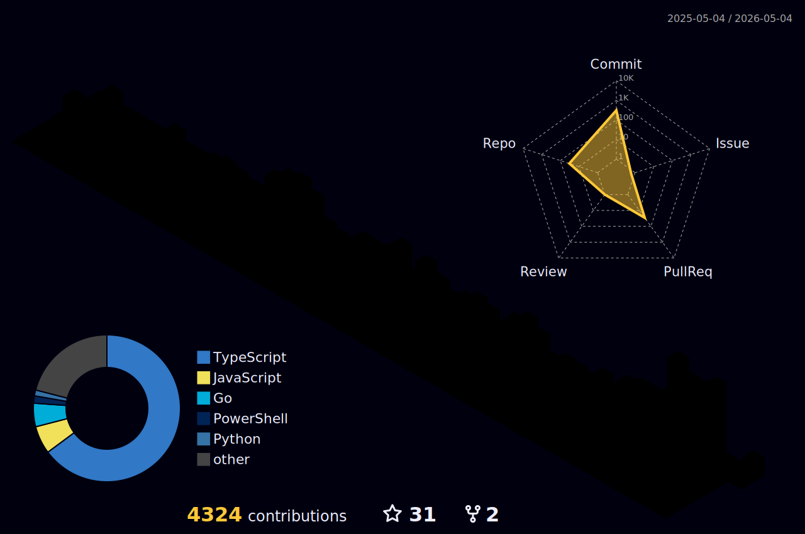

<div align="center">


[](https://git.io/typing-svg)

<br/>

[](https://www.linkedin.com/in/felipeness/)
[](mailto:felipecoelho.ness@gmail.com)
[](https://github.com/Felipeness/the-whole-and-the-part)

[](https://github.com/Felipeness)
[](https://github.com/Felipeness)

</div>

---

## <picture></picture> About me

```ts
const felipe = {
  role: "Backend & Distributed Systems Engineer",
  location: "Brasil",
  thesis: "Holonomic Systems — Koestler's holons applied to software",
  currentlyBuilding: ["Nessy", "Holonomic Architecture", "LicitaWin"],
  writing: ["The Whole and the Part (EN)", "Ferro e Espírito (PT-BR)"],
  philosophy: "Vocabulary is correct. Execution is in the detail.",
  motto: "Code is poetry. Performance is art.",
} as const;
```

> *"A holon is simultaneously a whole and a part. So is every module worth building."*

---

##  Now

```text
🔨 Building       Nessy v0.1 — hybrid search RRF over Claude Code sessions
📝 Writing        The Whole and the Part — Chapter Lineage (EN translation)
🧪 Shipping       LicitaWin — AI-powered public procurement SaaS (BR)
🛰  Daily          Echo-Atende — distributed messaging (NestJS · MongoDB · Kafka · FastAPI services)
🌱 Learning       Kubernetes · Terraform · Advanced ML · Multi-agent orchestration
🌐 Exploring      Temporal · Rust · Effect-TS · Holonomic Multi-Agent Systems
🤝 Open to        OSS collabs on NestJS · Effect-TS · Claude Code tooling
```

---

##  Building in public

<table>
<tr>
<td width="50%" valign="top">

### [🧠 Nessy](https://github.com/Felipeness/nessy)
**Nano Episodic Session Studio**

Local indexer + analytics for all your Claude Code sessions. Hybrid search (BM25 + embeddings + RRF) over `~/.claude/projects/*.jsonl`. Single Go binary, zero cloud egress.

`Go 1.26` `SQLite` `Ollama` `Bubble Tea` `MCP`

</td>
<td width="50%" valign="top">

### [📖 The Whole and the Part](https://github.com/Felipeness/the-whole-and-the-part)
**Open-source book on Holonomic Architecture**

Arthur Koestler's holons applied to distributed systems. 62 chapters covering Janus Effect, SCS, vertical slicing, Conway's Law alignment.

`Architecture` `Theory` `CC BY-SA 4.0`

</td>
</tr>
<tr>
<td width="50%" valign="top">

### [⚡ Holonomic Architecture](https://github.com/Felipeness/holonomic-architecture)
**Production reference for Holonomic Systems**

Fastify + Effect-TS + Temporal + schema-per-holon. Law of Imports enforced: holons never import from each other, only from `@holonomic/shared`.

`Effect-TS` `Fastify` `Temporal` `Event Sourcing`

</td>
<td width="50%" valign="top">

### [🏥 appointment-api](https://github.com/Felipeness/appointment-api)
**Healthcare scheduling — DDD reference**

Transactional Outbox + Saga + Circuit Breaker. NestJS + Prisma + SQS. Demo only.

`NestJS` `Prisma` `AWS SQS` `Redis` `DDD`

</td>
</tr>
<tr>
<td width="50%" valign="top">

### [📊 claude-statusline](https://github.com/Felipeness/claude-statusline)
**Statusline for Claude Code with visual editor**

Single Go binary. 16 components, 5 themes, drag-and-drop browser studio. Web UI embedded via `//go:embed`.

`Go` `React` `Bubble Tea`

</td>
<td width="50%" valign="top">

### [🦀 Ferro e Espírito](https://github.com/Felipeness/ferro-e-espirito)
**Livro aberto sobre Rust em pt-BR**

62 capítulos, 28k+ linhas. Filosofia + prática, com comparações com TypeScript, Go e C. Para quem já é senior em outra linguagem.

`Rust` `pt-BR` `Open book`

</td>
</tr>
</table>

### Enterprise (production work)

<table>
<tr>
<td width="50%" valign="top">

### [👥 Yamaha Fit RH](https://www.afinidadeatitudeazul.com.br/)
**Enterprise HR Platform — Yamaha Brazil**

Multi-tenant cultural fit assessment system for national HR operations. Multi-unit RBAC, 40-question alignment assessment, advanced reporting + Excel export.

`Next.js` `NestJS 11` `Prisma` `Docker` `JWT/RBAC`

</td>
<td width="50%" valign="top">

### 📡 Echo-Atende (private)
**Distributed messaging at Superlogica**

Real-time atendimento platform — multi-channel routing, FastAPI microservices, Kafka event bus, MongoDB conversation store.

`NestJS` `FastAPI` `MongoDB` `Kafka` `RabbitMQ` `Redis`

</td>
</tr>
</table>

---

##  Open Source Contributions

Merged upstream in production-grade projects:

<div align="center">

| Repository | Stars | PR | Contribution |
|---|---|---|---|
| [🔌 **prisma/prisma**](https://github.com/prisma/prisma/pull/29317) |  | [#29317](https://github.com/prisma/prisma/pull/29317) | Extract `PRISMA_CLIENT_JS_PROVIDER` constant — refactor across 4 packages |
| [🛠 **twentyhq/twenty**](https://github.com/twentyhq/twenty/pull/18495) |  | [#18495](https://github.com/twentyhq/twenty/pull/18495) | Clear error message on invalid `LOG_LEVELS` config |
| [📅 **calcom/cal.com**](https://github.com/calcom/cal.com/pull/28479) |  | [#28479](https://github.com/calcom/cal.com/pull/28479) | i18n pluralization for apps count |
| [🔐 **unkeyed/unkey**](https://github.com/unkeyed/unkey/pull/5251) |  | [#5251](https://github.com/unkeyed/unkey/pull/5251) | Error feedback for duplicate env var keys |

</div>

---

##  Impact

<div align="center">

| Area | Result |
|---|---|
| **Performance** | Reduced LCP by **60%** with SSR, code splitting & targeted caching |
| **AI in Production** | OpenAI + Gemini for document automation at scale (LicitaWin) |
| **Architecture** | Hexagonal + DDD + Event Sourcing + Saga + Outbox in production NestJS systems |
| **Delivery** | Cut release cycles **30%** with CI/CD & preview environments per PR |
| **Enterprise** | Multi-tenant RBAC systems for national brands (Yamaha, Echo-Atende) |
| **Open Source** | 4 PRs merged in projects with 130k+ aggregate stars (Prisma, Twenty, Cal.com, Unkey) |

</div>

---

##  Tech Stack

<div align="center">

**Languages**


**Frameworks & Runtime**


**Data & Messaging**


**Infrastructure & DevOps**


**Architecture & Patterns**


**Observability**


</div>

---

##  GitHub Stats

<div align="center">


<br/>


</div>

---

##  Activity Graph

<div align="center">

[](https://github.com/ashutosh00710/github-readme-activity-graph)

</div>

---

##  Profile Summary

<div align="center">

[](https://github.com/vn7n24fzkq/github-profile-summary-cards)

[](https://github.com/vn7n24fzkq/github-profile-summary-cards)
[](https://github.com/vn7n24fzkq/github-profile-summary-cards)

[](https://github.com/vn7n24fzkq/github-profile-summary-cards)
[](https://github.com/vn7n24fzkq/github-profile-summary-cards)

</div>

---

##  Trophies

<div align="center">

[](https://github.com/ryo-ma/github-profile-trophy)

</div>

---

##  3D Contributions

<p align="center">
  
</p>

---

##  Writing

- 📖 [**The Whole and the Part**](https://github.com/Felipeness/the-whole-and-the-part) — Holonomic Software Architecture (EN, 62 chapters, in progress)
- 🦀 [**Ferro e Espírito**](https://github.com/Felipeness/ferro-e-espirito) — Rust em pt-BR (62 capítulos, 28k+ linhas)
- ✍️ Articles on holonomic systems, Effect-TS in production, hybrid search with RRF — *coming to dev.to*

---

<div align="center">

###  Let's connect

[](mailto:felipecoelho.ness@gmail.com)
[](https://www.linkedin.com/in/felipeness/)

<br/>

<sub>⚡ <i>Code is poetry. Performance is art.</i> ⚡</sub>

<br/>


</div>
