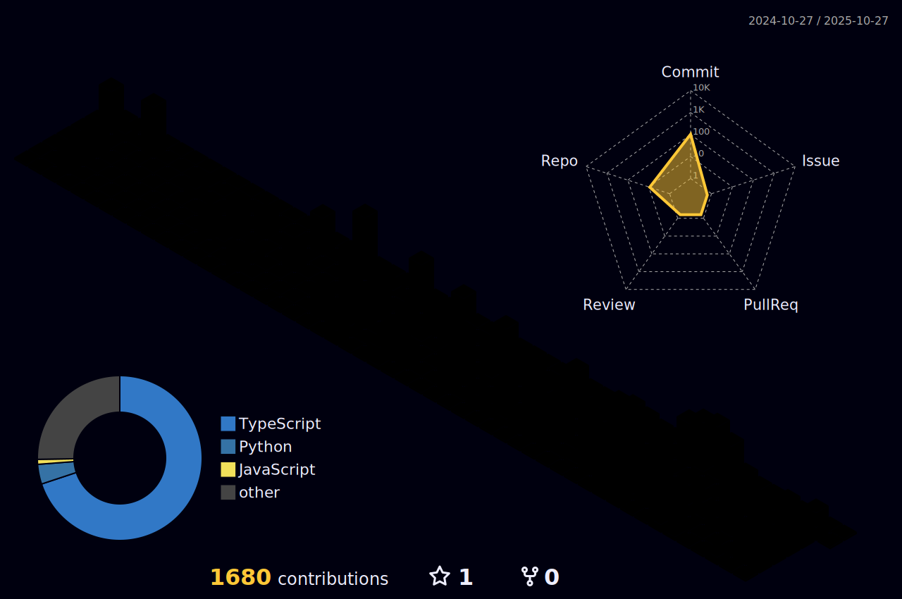

<!-- Clean Dark README (with external SVG reference) -->

<b>Computer Engineer</b> building fast, scalable and delightful web products.

---

## 🛠 Tech Stack

  

---

## 🧩 3D Contributions

  

---

## ✨ Highlights

- Reduced **LCP by 60%** using SSR, code splitting and targeted caching (Next.js + TypeScript).
- Built interactive **vector map tools** (Google Maps + React) with freehand drawing and two-way sync.
- Delivery time down **30%** with CI/CD, preview environments per PR (GitHub Actions + Vercel/AWS).
- Designed scalable UI foundations with **Design Systems**, **Atomic Design** and tokens.
- Strong collaboration with product, QA and back-end for reliable, test-driven releases.

---

## 🔗 Connect

  
  
  

---

  “Code is poetry. Performance is art.”

